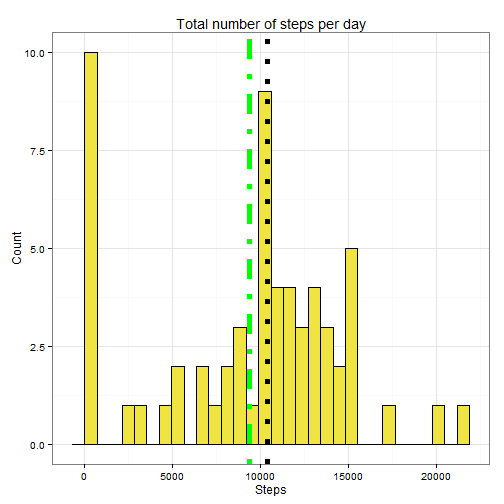
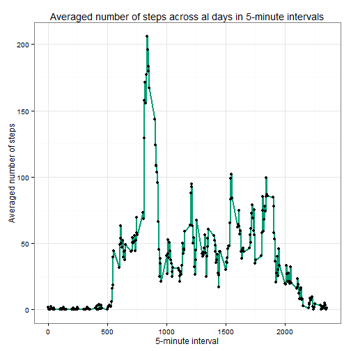
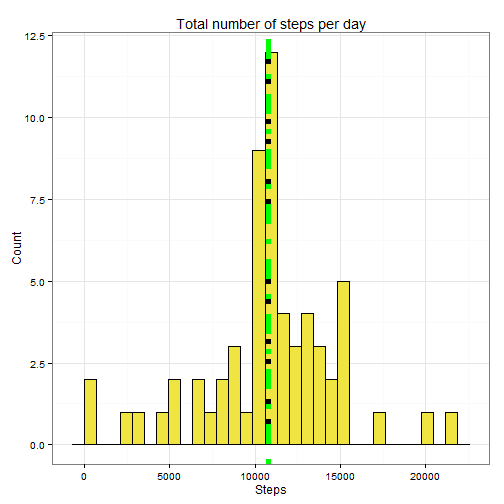
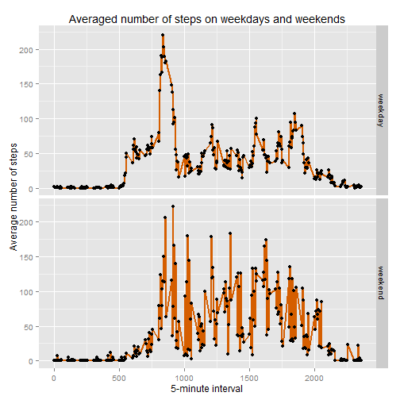

Peer Assesment 1 for Reproducible Research
---

1. Loading necessary packages


```r
library(data.table)
library(dplyr)
library(ggplot2)
library(rmarkdown)
```
2. Loading data from the working directory and creating a table of total number of steps for every date


```r
activity <- read.csv('activity.csv')
activity <- data.table(activity)
activity_sum <- activity[,sum(steps, na.rm = TRUE), by = date]
activity_sum <- rename(activity_sum, steps = V1)
```
3. Histogram of total steps per day.   
Green vertical line - mean,   
Black vertical line - median


```r
g <- ggplot(activity_sum, aes(steps))
g + geom_histogram(fill = "#F0E442", colour = "#000000")+ labs(title = 'Total number of steps per day')+ xlab('Steps')+ylab('Count')+theme_bw()+geom_vline(aes(xintercept = median(steps, na.rm = T)), lwd = 2, lty = 3)+ geom_vline(aes(xintercept = mean(steps, na.rm = T)), lty = 4,lwd = 2, colour = 'green')
```

```
## stat_bin: binwidth defaulted to range/30. Use 'binwidth = x' to adjust this.
```

 

4. Finding numbers of mean and median for total number of steps for each date


```r
mean_median <- activity_sum[,c(mean(steps, na.rm = TRUE), median(steps, na.rm = TRUE))]
print(mean_median)
```

```
## [1]  9354.23 10395.00
```

5. calculating averaged number of steps across all days 


```r
activity_mean <- activity[,mean(steps, na.rm = TRUE), by = interval]
activity_mean <- rename(activity_mean, steps = V1)
```
6. Creating time-series plot of averaged number of steps in different 5-minute intervals

```r
g2 <- ggplot(activity_mean, aes(interval, steps))
g2 + geom_line(lwd = 1, colour = '#009E73')+xlab('5-minute interval') + ylab('Averaged number of steps') + ggtitle('Averaged number of steps across al days in 5-minute intervals') + theme_bw()+ geom_point()
```

 
  
7.Finding the interval for maximum averaged number of steps

```r
max_interval <- filter(activity_mean, steps = max(steps))
print(max_interval)
```

```
##    interval    steps
## 1:     1705 56.30189
```
8. Calculating the total number of missing values in the dataset

```r
NAs <- table(is.na(activity$steps))
NAs <- data.frame(NAs)
NAs <- data.table(NAs)
NAs_number <- NAs$Freq[2]
print(NAs_number)
```

```
## [1] 2304
```
9. Replacing missing values by averaged number of steps for each of the intervals

```r
activity_complete <- na.exclude(activity)
activity$date <- as.Date(activity$date)
activity <- mutate(activity, weekdays = weekdays(date))
activity_complete$date <- as.Date(activity_complete$date)
activity_complete <- mutate(activity_complete, weekdays = weekdays(date))
NAs <- filter(activity, is.na(steps))
NAs <- merge(NAs, activity_mean, by = 'interval')
NAs <- select(NAs, c(-(steps.x)))
NAs <- rename(NAs, steps = steps.y)
activity_full <- rbind(activity_complete, NAs)
```
activity_full is a new dataset without missing values  
10. Creating a histogram similar to the first one, but without missing values

```r
activity_full_sum <- activity_full[,sum(steps), by = date]
activity_full_sum <- rename(activity_full_sum, steps = V1)
g3 <- ggplot(activity_full_sum, aes(steps))
g3 + geom_histogram(fill = "#F0E442", colour = "#000000")+ labs(title = 'Total number of steps per day')+ xlab('Steps')+ylab('Count')+theme_bw()+geom_vline(aes(xintercept = median(steps, na.rm = T)), lwd = 2, lty = 3)+ geom_vline(aes(xintercept = mean(steps, na.rm = T)), lty = 4,lwd = 2, colour = 'green')
```

```
## stat_bin: binwidth defaulted to range/30. Use 'binwidth = x' to adjust this.
```

 

11. Calculating numbers of mean and median for total number of steps for each date

```r
mean_median2 <- activity_full_sum[,c(mean(steps), median(steps))]
print(mean_median2)
```

```
## [1] 10766.19 10766.19
```
12.Adapting R to understand Russian words in column 'weekdays'

```r
Sys.getlocale()
```

```
## [1] "LC_COLLATE=Russian_Russia.1251;LC_CTYPE=Russian_Russia.1251;LC_MONETARY=Russian_Russia.1251;LC_NUMERIC=C;LC_TIME=Russian_Russia.1251"
```
13. Creating factor variable for weekdays and weekends . 'Суббота, воскресенье' are Saturday and Sunday in Russian

```r
activity_full <- mutate(activity_full, on_off = ifelse(activity_full$weekdays == c('суббота', 'воскресенье'), 'weekend', 'weekday'))
```
14. Calculating averaged number of steps for weekdays and weekends

```r
activity_weekday <- activity_full[,mean(steps), by = c('interval','on_off')]
```
15. Creating a panel plot of the 5-minute interval and the average number of steps across all weekdays and weekends

```r
g4 <- ggplot(activity_weekday, aes(interval, V1))
g4 + geom_line(lwd = 1, colour = "#D55E00") + xlab('5-minute interval')+ylab('Average number of steps')+ ggtitle('Averaged number of steps on weekdays and weekends') + geom_point()+ facet_grid(on_off~.)
```

 
